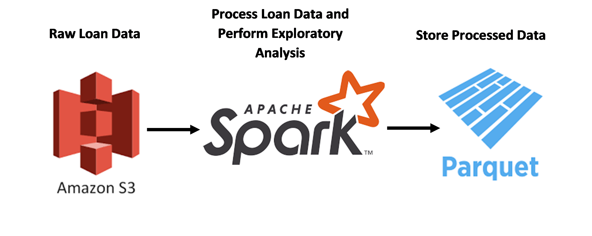

# lending-club-analysis
Exploratory Data Analysis and ETL Pipelining for Lending Club Data

### Overview
This repository delves into the [Kaggle Lending Club Loan Dataset](https://www.kaggle.com/wendykan/lending-club-loan-data) 
and contains code to generate analytical insights as well as a pipeline to accommodate incoming batches of loan data and 
set up a workflow optimal for data warehousing. More specifically, this repository covers:
- **Data Analysis:** How do certain factors such as debt-to-income ratio (DTI), requested loan amount, and 
annual income correlate with whether a loan was fully paid back or not? These insights help point data scientists
and analysts to important patterns in the data and help Lending Club better understand its loan requesters as well as
make smarter decisions about who to provide loans to in the future.
- **Data Pipelining:** What code and workflow can feed a data warehouse system for data scientists and analysts to
interact with? How can this system be designed such that it is automated, maintainable, robust, and capable of processing
periodic updates in the data?
     
### The Dataset
The Kaggle Lending Club Loan Dataset contains complete loan data for all loans issued by the Lending Club, a
peer-to-peer lending company based in San Francisco, from 2007 to 2015. There are around 890,000 observations and 75
variables. A data dictionary explaining each variable can be found on the Kaggle dataset link in the Overview section,
under the "Data" tab.

### Codebase
The codebase is organized as follows:

```
src
|-----exploratory_analysis.py
|-----loan_ETL.py
img
|-----<exploratory analysis images>
```

`exploratory_analysis.py` contains the code used to run exploratory analysis on the loan dataset, and
`loan_ETL.py` contains the code to run the ETL pipeline and provide the reading and processing data functions
that the exploratory analysis uses as well.

### Running the Code
For this project, I used Databricks, a notebook programming interface, to execute code and run my 
pipeline. The interface and workflow is similar to Jupyter, but Databricks is designed to work well with
Spark-intensive applications, which could be desirable for this pipeline if more data and more intensive
computations are integrated in the future. If you would like to run the code in this repository, copy it into Databricks
, which has a community edition for free cluster usage.

### Exploratory Data Analysis

__Code in src/exploratory_analysis.py__

To begin the analysis, I generated a summary statistic regarding the nature of people applying for loans,
mainly the distribution of their annual incomes. This statistic helps us better understand the people who
are applying for loans. While the average annual income of a loan requester
is not far from the mean annual income per American, there is a heavy right skew caused by some people
with very high incomes (the highest at over $100 million). Looking through the employment titles of 
some of the people, the employment titles did not seem to match up (i.e., Waitress or Building Official/Inspector).
Further investigation would need to be done into what caused these anomalous incomes to make it into
the loan data (incorrectly processed data, Lending Club doesn't check employment title and/or annual income
as rigorously as it should, etc.).  


The next summary statistic concerns the count of each type of loan status. This is a useful statistic for 
better understanding the rate at which loans are not paid back as well as providing information on the
different types of loan statuses which we can do a deeper dive into. In the two visualizations in this section,
I will show how I consolidated loan statuses into good or bad standing.


After exploring the data, one aspect I wanted to hone in on was the statuses of loans and factors that may
contribute to those statuses. Knowing factors that lead to different loan statuses is critical for Lending Club's
business model as they can better understand whether someone applying for a loan will pay it back in full and 
assign the appropriate rating to the loan. The heatmap I produced looks at the amount requested for the loan,
on the x-axis and rounded to the nearest $10,000 to allow for bucketing, and the annual income, rounded to the nearest
power of 10 to prevent especially high incomes from dominating the graph. The values, or colors, in the heatmap correspond
to the percentage of loans that are in good standing.

From this heatmap, it is interesting to note that there is no clear correlation between loan amount requestd,
annual income, and whether a loan will be paid back or not. However, very low reported incomes have a higher
payback rate on average.


Finally, I generated a boxplot to see whether loans in good or bad standing were correlated with one's 
debt-to-income (DTI) ratio. Presumably people with higher DTI values would be more at risk for not paying back
a loan, but after looking further into the data there did not seem to be any significant correlation. This implies that
other factors would contribute to whether one's loans will more likely be in good or bad standing.


### Pipeline



The pipeline shown above highlights the three main components of taking raw loan data and feeding it
into a warehouse:

- __Raw data storage__: as new raw loan data comes in, it 