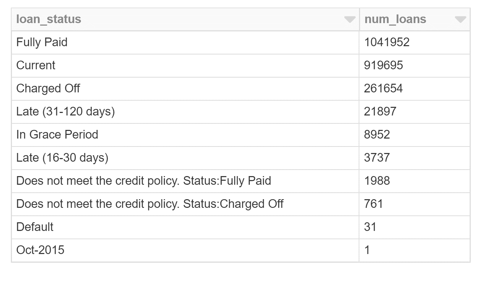
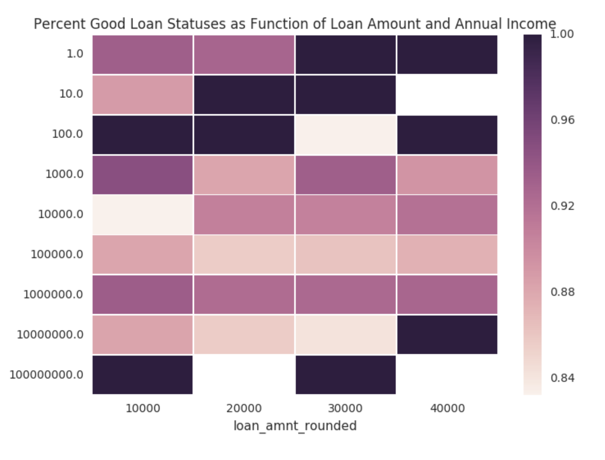
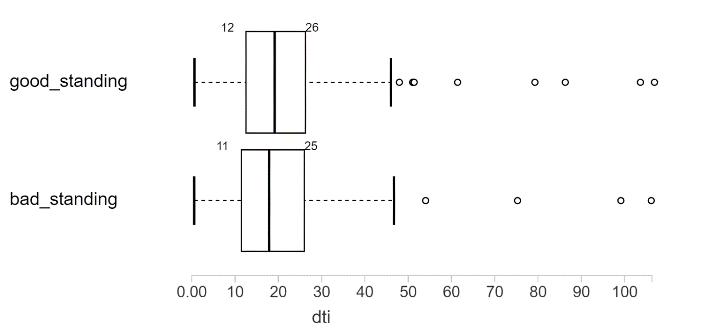
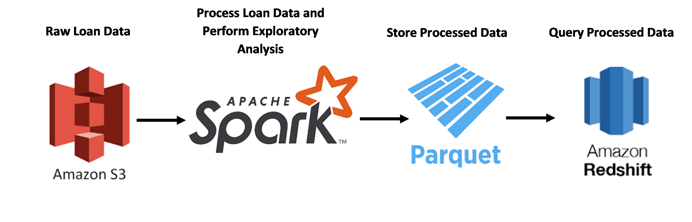

# lending-club-analysis
Exploratory Data Analysis and ETL Pipelining for Lending Club Data

# Overview
This repository delves into the [Kaggle Lending Club Loan Dataset](https://www.kaggle.com/wendykan/lending-club-loan-data) 
and contains code to generate analytical insights as well as a pipeline to accommodate incoming batches of loan data and 
set up a workflow optimal for data warehousing. More specifically, this repository covers:
- **Data Analysis:** How do certain factors such as debt-to-income ratio (DTI), requested loan amount, and 
annual income correlate with whether a loan was fully paid back or not? These insights help point data scientists
and analysts to important patterns in the data and help Lending Club better understand its loan requesters as well as
make smarter decisions about who to provide loans to in the future.
- **Data Pipelining:** What code and workflow can feed a data warehouse system for data scientists and analysts to
interact with? How can this system be designed such that it is automated, maintainable, robust, and capable of processing
periodic updates in the data?
     
# The Dataset
The Kaggle Lending Club Loan Dataset contains complete loan data for all loans issued by the Lending Club, a
peer-to-peer lending company based in San Francisco, from 2007 to 2015. There are around 890,000 observations and 75
variables. A data dictionary explaining each variable can be found on the Kaggle dataset link in the Overview section,
under the "Data" tab.

# Codebase
The codebase is organized as follows:

```
src
|-----exploratory_analysis.py
|-----loan_ETL.py
img
|-----<exploratory analysis images>
```

`exploratory_analysis.py` contains the code used to run exploratory analysis on the loan dataset, and
`loan_ETL.py` contains the code to run the ETL pipeline and provide the reading and processing data functions
that the exploratory analysis uses as well.

# Setup
For this project, I used Databricks, a notebook programming interface, to execute code and run my 
pipeline. The interface and workflow is similar to Jupyter, but Databricks is designed to work well with
Spark-intensive applications, which could be desirable for this pipeline if more data and more intensive
computations are integrated in the future.

To run this project, the setup is as follows:
1. Create a Databricks Community account at https://community.cloud.databricks.com/.
2. Create an AWS account, generate an access key pair, and record the access and secret key values.
In S3, create a new bucket and two folders, one to handle uploading raw loan data and the other to store
processed loan data. Upload any raw files as necessary to the raw loan data folder.
3. In your Databricks account, create a notebook called `!_creds`. Put the following code in the file:

    ```
    AWS_ACCESS_KEY = "<access key>"
    AWS_SECRET_KEY = "<secret key>"
    ```

4. Create a new notebook in Databricks for the ETL. Insert the command `%run ./!_creds` at the top and run it to import
the credentials from step 3.
5. If you would like to run the exploratory analysis, create another notebook in Databricks and run the `!_creds` file at the top. 
6. To run the ETL and exploratory analysis code, either copy the code in the `src` folder into the respective Databricks notebook directly,
or create a Python egg for each file and load into Databricks library using this guide: https://forums.databricks.com/questions/12855/how-to-install-python-package-from-github-on-datab.html.
Before running the code, make sure the config file in the `main()` method is adjusted to reflect your bucket and
folder names. The raw folder name may need to point to a specific file rather than a folder if you want to read only
certain files in the raw data folder.
7. If you would like to set up a Redshift cluster for querying from Parquet, visit the following link: https://docs.aws.amazon.com/redshift/latest/gsg/rs-gsg-launch-sample-cluster.html.
If you have not set up Redshift yet on your AWS account, you can run it for two months for free.

# Exploratory Data Analysis

__Code in src/exploratory_analysis.py__

To begin the analysis, I generated a summary statistic regarding the nature of people applying for loans,
mainly the distribution of their annual incomes. This statistic helps us better understand the people who
are applying for loans. While the average annual income of a loan requester
is not far from the mean annual income per American, there is a heavy right skew caused by some people
with very high incomes (the highest at over $100 million). Looking through the employment titles of 
some of the people, the employment titles did not seem to match up (i.e., Waitress or Building Official/Inspector).
Further investigation would need to be done into what caused these anomalous incomes to make it into
the loan data (incorrectly processed data, Lending Club doesn't check employment title and/or annual income
as rigorously as it should, etc.).  


The next summary statistic concerns the count of each type of loan status. This is a useful statistic for 
better understanding the rate at which loans are not paid back as well as providing information on the
different types of loan statuses which we can do a deeper dive into. In the two visualizations in this section,
I will show how I consolidated loan statuses into good or bad standing.


After exploring the data, one aspect I wanted to hone in on was the statuses of loans and factors that may
contribute to those statuses. Knowing factors that lead to different loan statuses is critical for Lending Club's
business model as they can better understand whether someone applying for a loan will pay it back in full and 
assign the appropriate rating to the loan. The heatmap I produced looks at the amount requested for the loan,
on the x-axis and rounded to the nearest $10,000 to allow for bucketing, and the annual income, rounded to the nearest
power of 10 to prevent especially high incomes from dominating the graph. The values, or colors, in the heatmap correspond
to the percentage of loans that are in good standing.

From this heatmap, it is interesting to note that there is no clear correlation between loan amount requestd,
annual income, and whether a loan will be paid back or not. However, very low reported incomes have a higher
payback rate on average.


Finally, I generated a boxplot to see whether loans in good or bad standing were correlated with one's 
debt-to-income (DTI) ratio. Presumably people with higher DTI values would be more at risk for not paying back
a loan, but after looking further into the data there did not seem to be any significant correlation. This implies that
other factors would contribute to whether one's loans will more likely be in good or bad standing.



# Pipeline



The pipeline shown above highlights the three main components of taking raw loan data and feeding it
into a warehouse:

- __Raw data storage__: as new raw loan data is generated, it will be stored in S3 in the original CSV format.
- __Data processing__: Using Pyspark in Databricks, this section takes the raw loan
data and processes it in a few ways:
    - Rounds annual income and loan request to powers of 10 and the nearest $10,000, respectively, to allow for
    easy bucketing when generating the heatmap
    - Adds a timestamp with the current time to all loans in the dataset, to differentiate updates to the dataset.
    - Buckets loans into "good standing" or "bad standing" based on whether loan is fully paid/current or 
    late/charged off, respectively. Loans that fell into other designations were marked as "unknown" since their status
    was less definitive.
- __Processed data storage__: After the data processing is finished, the final results are written back to S3 in
parquet file format, with a partition on the timestamp generated in processing. Parquet is a good choice here because the
loan data contains a large number of columns, so standard row-based storage will present performance issues when querying
or performing intensive computations such as joins. In contrast, parquet's columnar storage alleviates these issues. While parquet
itself is not a data warehouse, __AWS Redshift__ can easily integrate with parquet and serve as the data warehouse portion
for this pipeine. 

The technologies above were used due to their simplicity, computational abilities, and versatility. S3 is an
inexpensive and flexible file storage system, so CSV, JSON, Parquet, and other common file formats can easily be
integrated in case the input or output data formats change. Spark and Databricks are advantageous for computational purposes: since they can
process large amounts of data in a relatively short amount of time, data scientists and analysts can quickly query
data, build models, and perform aggregations and joins. Additionally, Spark has a built-in machine learning library for quicker
training, validation, and testing on datasets. Finally, storing the processed data in parquet allows for easy integration
 with Redshift to build a data warehouse, and the queries are faster since the columnar storage is optimal, as stated in the "Processed data storage" section above.
 While I considered traditional relational databases for this pipeline, given that there may be need to scale up data processing
 and ingestion significantly in the future I wanted to build a system capable of scaling better.    


One challenge presented by this dataset was that the id and member_id fields were empty for all rows. This meant that
there was no sure way to identify whether two rows represented the same loan. While checking all of the other
row values would most likely identify a loan uniquely, this operation would be computationally too intensive.
Therefore, this pipeline cannot easily implement two components I wanted to have:
- A star schema to encapsulate loan data in the fact table, user data in a dimension table, and loan history in another
dimension table.
- The ability to join new loan data into existing loan data to prevent duplicates and merge time-based data (for
example, see how the payment of a loan has evolved over time)

# Improvements

With more time, I would explore the following improvements to this pipeline:
- Type casting for every field in the dataset. Currently the CSV has everything in string format, so
fields in my exploratory analysis had to be cast to int and float types but other fields were left as
strings.
- A partial star schema layout
- Aggregations of loan data over time to see how the payment of a loan is evolving  
- Further investigation into anomalous data encountered during exploratory analysis
- A means of identifying only new data to be run through the pipeline. Currently the path to the new
raw data needs to be specified, but some trigger with every new uploaded file or a database keeping track of
all data processed so far could be implemented